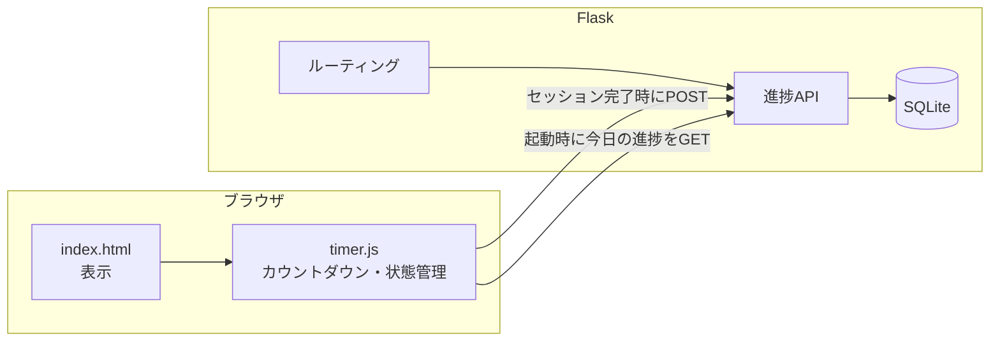
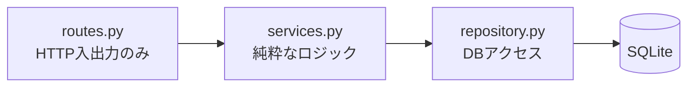
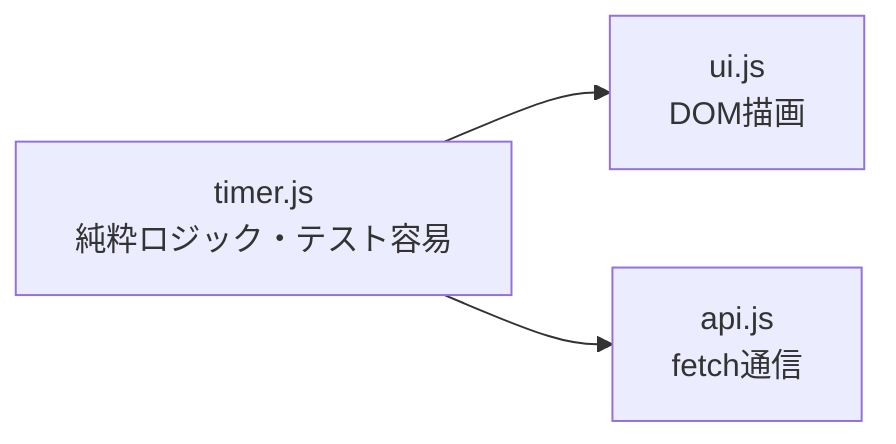
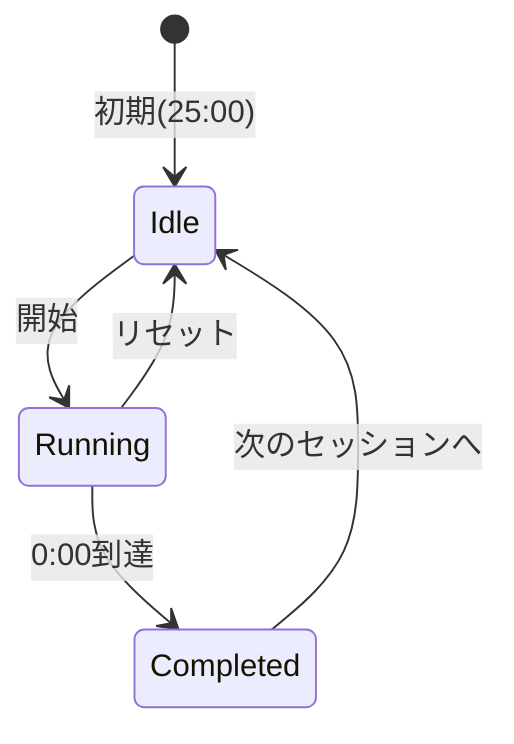

# ポモドーロタイマー Web アプリ アーキテクチャ案

Flask + HTML/CSS/JavaScript で実装するポモドーロタイマー Web アプリのアーキテクチャ提案をまとめる。
ユニットテストのしやすさ（テスト容易性）を重視した設計とする。

## 1. 全体方針

このアプリの特性を踏まえた重要な設計判断は次の2点。

1. **タイマーのカウントダウンはサーバーではなくブラウザ（JavaScript）側で行う**
   1秒ごとにサーバー通信するのは無駄で、オフラインでも動作しなくなる。Flask はページ配信と「進捗データの永続化API」に徹する。
2. **「今日の進捗（完了数・集中時間）」の保存先** がアーキテクチャの分岐点。
   学習・ワークショップ目的とのバランスから **Flask + SQLite** を採用する。

### 保存方式の比較

| 案 | 進捗の保存先 | Flask の役割 | 向いているケース |
|---|---|---|---|
| A. フロント完結 | ブラウザの `localStorage` | 静的配信のみ | まず動くものを最速で作りたい |
| **B. Flask + SQLite（採用）** | サーバーの SQLite DB | REST API + 配信 | 複数端末で進捗共有、学習目的 |
| C. ユーザー認証付き | DB（ユーザー単位） | API + 認証 | 本格運用 |

## 2. 責務の分離（全体像）



- **JavaScript**: 状態（作業中／休憩中／停止）、残り時間のカウントダウン、開始・リセット操作、円形プログレスの更新。**1ポモドーロ完了した瞬間だけ** サーバーに記録を送る。
- **Flask**: ページ配信と、進捗の保存・取得API。タイマー自体は持たない。

## 3. テスト容易性を重視した設計の核心

> **副作用（DB・HTTP・時刻・DOM）を端に追いやり、中心を純粋ロジックにする。**
> **時刻や依存を「注入」できるようにする。**
> **層を薄く分ける（routes / services / repository、timer / ui / api）。**

### サーバー側の改善点

1. **アプリケーションファクトリ + DI で DB 依存を切る**
   `create_app(config)` 形式にし、テストでは in-memory DB（`sqlite:///:memory:`）に差し替え可能にする。テストごとにクリーンなDBを使え、テスト同士が干渉しない。

   ```python
   def create_app(config=None):
       app = Flask(__name__)
       app.config.update(config or {})
       # DB初期化やBlueprint登録
       return app
   ```

2. **ビジネスロジックをサービス層に分離**
   集計・バリデーションをルート関数の外に出し、HTTP を経由せず単体テスト可能にする。

3. **「時刻」を注入可能にする**
   「今日の進捗」は `datetime.now()` に依存するため、時刻提供を引数 or 関数注入にし、日付境界をテストできるようにする（または `freezegun` で固定）。

4. **入力バリデーションを関数化**
   `POST /api/sessions` の入力（種類・長さ）の検証を独立関数にし、不正値を単体テストで網羅。サーバー側で必ず検証する（クライアントの送信値を信用しない、OWASP 観点）。

### サーバー側のレイヤ構成



- **routes**: リクエスト受取 → サービス呼出 → JSON返却だけ（薄く）
- **services**: 集計・バリデーションなどの純粋関数中心（ここを重点的に単体テスト）
- **repository**: DB の CRUD（差し替え可能なインターフェースに）

### フロント側の改善点

5. **タイマーロジックを DOM から分離**
   `PomodoroTimer` クラスを作り、DOM操作・通信を一切含めない純粋な状態機械にする。表示更新は外から渡すコールバックに任せる。

   ```js
   // timer.js — テスト対象（副作用なし）
   class PomodoroTimer {
     constructor({ durationSec, now = () => Date.now() }) { /* ... */ }
     start() {}        // 状態遷移
     remaining() {}    // 残り時間の算出（now依存を注入で制御）
     isCompleted() {}
   }
   ```

   - `now` を注入することで「29秒後の残り時間」などを `setInterval` を実際に待たずに検証できる。

6. **API通信を1モジュールに集約**
   `fetch` を散らさず `api.js` にまとめ、テスト時にモックしやすくする。



## 4. フロント側の状態管理

タイマーは有限ステートマシンとして実装するとバグが減る。



- 残り時間は「**開始時刻 + 設定時間** から算出」する方式にすると、タブが非アクティブで `setInterval` がずれてもタイマーが狂わない（累積カウントに頼らない）。

### 円形プログレス（UIモックの円）

外部ライブラリなしで実現する。

- **SVG の `<circle>` + `stroke-dasharray` / `stroke-dashoffset`** を JavaScript で更新（軽量・推奨）
- または CSS の `conic-gradient`

## 5. API 設計

| メソッド | パス | 役割 |
|---|---|---|
| GET | `/` | メイン画面（index.html）を返す |
| GET | `/api/progress` | 今日の進捗（完了数・合計集中分）を返す |
| POST | `/api/sessions` | 1ポモドーロ完了を記録（種類・長さを送信） |

レスポンス例（`GET /api/progress`）:

```json
{ "completed": 4, "focus_minutes": 100 }
```

## 6. ディレクトリ構成

```
1.pomodoro/
├── app.py              # create_app() を呼ぶエントリのみ
├── pomodoro/
│   ├── __init__.py     # create_app(): アプリファクトリ
│   ├── routes.py       # HTTP入出力（薄い）
│   ├── services.py     # 純粋なビジネスロジック ← 重点テスト
│   ├── repository.py   # DBアクセス（差し替え可能）
│   └── validators.py   # 入力検証
├── static/
│   ├── css/style.css   # 見た目（カード・円形プログレス）
│   └── js/
│       ├── timer.js    # 純粋な状態機械 ← 重点テスト
│       ├── ui.js       # DOM描画
│       └── api.js      # fetch通信
├── templates/index.html
├── requirements.txt
├── requirements-dev.txt  # pytest, pytest-flask, freezegun など
└── tests/
    ├── test_services.py
    ├── test_validators.py
    └── test_routes.py
```

## 7. テスト構成

| 対象 | ツール | 内容 |
|---|---|---|
| サービス層 | `pytest` | 集計・境界値などの純粋ロジック（重点） |
| バリデーション | `pytest` | 不正入力の網羅 |
| 時刻依存 | `freezegun` | 日付境界の固定テスト |
| API（結合） | Flask `test_client()` | 実サーバー不要でルートを検証 |
| タイマーロジック | `vitest` or `jest` | `PomodoroTimer` を `now` 注入で検証 |

## 8. 段階的な進め方

最小構成を優先する場合、まず **「サービス層の分離」と「timer.js の純粋化」** の2点だけでもテスト容易性は大きく向上する。

実装は以下の順を推奨する。

1. `create_app()` とサービス層・バリデーション（サーバー骨組み）
2. `templates/index.html` + `static/css/style.css`（モック準拠のレイアウト）
3. `static/js/timer.js`（純粋ロジック）→ `ui.js` / `api.js`
4. `tests/` の単体テスト整備
